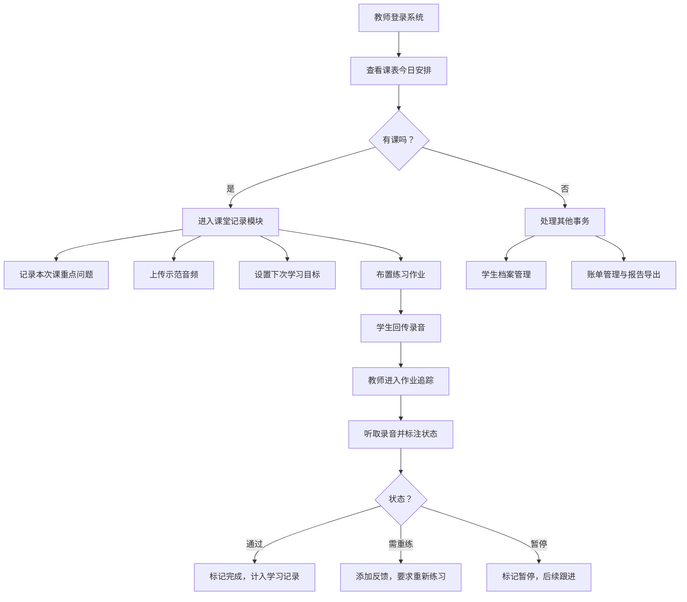

## 1. 产品概述
面向独立音乐教师的桌面客户端管理系统，帮助教师高效管理一对一课程、学生练习反馈和财务账单。解决教师在学生信息管理、课程调度、教学记录追踪和费用结算等方面的痛点。

## 2. 核心功能

### 2.1 用户角色
| 角色 | 注册方式 | 核心权限 |
|------|----------|----------|
| 音乐教师 | 本地账号创建 | 学生档案管理、课程调度、课堂记录、作业追踪、账单管理 |

### 2.2 功能模块
1. **学生档案窗口**：学生基本信息、学习水平、曲目偏好、家长联系方式
2. **课表窗口**：周视图课表、拖拽排课、固定课/临时补课/请假管理
3. **课堂记录窗口**：重点问题记录、示范音频上传、下次学习目标
4. **作业追踪窗口**：曲目段落拆分、练习录音回传、通过/重练/暂停标注
5. **账单窗口**：课时统计、材料费管理、欠费提醒、学习报告导出

### 2.3 页面详情
| 页面名称 | 模块名称 | 功能描述 |
|----------|----------|----------|
| 主界面 | 侧边导航 | 快速切换五个功能窗口，显示当前日期和未完成提醒 |
| 学生档案 | 学生列表 | 搜索、筛选、添加、编辑、删除学生信息 |
| 学生档案 | 学生详情 | 展示学生完整档案，包括学习历史和统计数据 |
| 课表 | 周视图 | 按周展示课程安排，支持拖拽调整时间 |
| 课表 | 课程卡片 | 显示课程类型（固定/补课/请假）、学生姓名、时间段 |
| 课堂记录 | 记录列表 | 按学生和日期筛选课堂记录 |
| 课堂记录 | 记录编辑 | 富文本编辑重点问题，上传示范音频，设置下次目标 |
| 作业追踪 | 曲目管理 | 按曲目拆分练习段落，分配给学生 |
| 作业追踪 | 录音管理 | 学生回传录音播放、标注状态（通过/需重练/暂停） |
| 账单 | 费用统计 | 按时间段统计课时费、材料费、欠费金额 |
| 账单 | 报告导出 | 生成简洁的PDF学习报告发送给家长 |

## 3. 核心流程

## 4. 用户界面设计

### 4.1 设计风格
- **主色调**：深靛蓝 (#1e3a5f) - 传达专业、稳重的教育氛围
- **辅助色**：暖金色 (#d4a574) - 象征音乐的温暖与活力
- **强调色**：薄荷绿 (#88c9a1) - 表示通过/完成；珊瑚红 (#e88a7a) - 表示提醒/欠费
- **中性色**：象牙白 (#faf8f5) 背景，深灰 (#2d3436) 文字
- **按钮风格**：圆角8px，细微阴影，悬停有柔和上浮效果
- **字体**：标题使用 "Noto Serif SC" 衬线字体体现优雅；正文使用 "Noto Sans SC" 无衬线保证可读性
- **布局**：卡片式布局，侧边导航 + 主内容区，窗口顶部有功能标题栏
- **图标风格**：使用线性风格图标，保持简洁专业

### 4.2 页面设计概述
| 页面名称 | 模块名称 | UI元素 |
|----------|----------|--------|
| 主框架 | 侧边导航 | 深色背景，图标+文字导航项，当前选中项高亮 |
| 学生档案 | 学生列表 | 卡片式布局，头像+姓名+简要信息，悬停显示操作按钮 |
| 学生档案 | 学生详情 | 标签页切换：基本信息、学习记录、作业情况、账单 |
| 课表 | 周视图 | 时间轴（8:00-22:00），七天列，课程块可拖拽，不同颜色区分课程类型 |
| 课堂记录 | 记录编辑 | 三段式布局：重点问题区、音频上传区、目标设置区 |
| 作业追踪 | 曲目练习 | 树形结构展示曲目-段落，状态标签颜色区分 |
| 账单 | 统计概览 | 大数字卡片展示收入统计，图表展示月度趋势 |
| 账单 | 报告预览 | 模拟A4纸张预览，导出按钮醒目 |

### 4.3 响应式
- 桌面端优先设计，窗口最小尺寸 1280x800
- 主内容区支持内部滚动，侧边栏固定宽度
- 窗口缩放时内容自适应，保持良好间距
