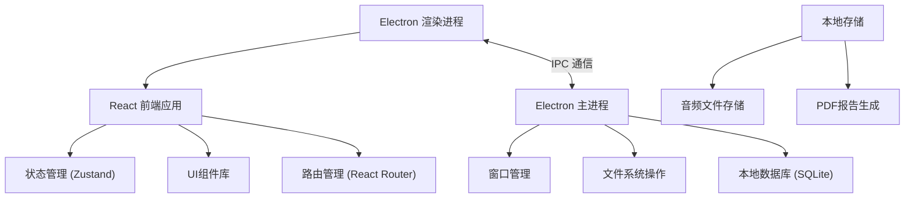
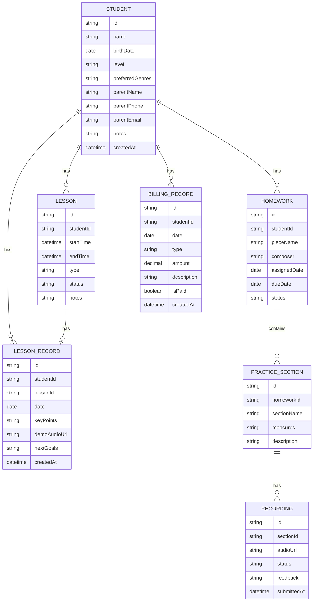

## 1. 架构设计



## 2. 技术描述

- **前端框架**: React@18 + TypeScript + Vite
- **桌面框架**: Electron@30
- **状态管理**: Zustand
- **样式方案**: TailwindCSS@3
- **路由管理**: React Router DOM@6
- **图标库**: Lucide React
- **本地数据库**: better-sqlite3
- **拖拽功能**: @dnd-kit/core + @dnd-kit/sortable
- **PDF生成**: jspdf + html2canvas
- **图表**: recharts
- **音频处理**: Web Audio API + waveform-data
- **UI组件**: 自研组件 (基于Radix UI原语)

## 3. 路由定义
| 路由 | 页面 | 用途 |
|------|------|------|
| / | 学生档案 | 默认页面，学生列表与详情 |
| /schedule | 课表 | 周视图课程安排 |
| /lessons | 课堂记录 | 课堂记录列表与编辑 |
| /homework | 作业追踪 | 作业与录音管理 |
| /billing | 账单 | 费用统计与报告导出 |

## 4. 数据模型

### 4.1 ER图



### 4.2 数据库初始化脚本

```sql
CREATE TABLE students (
    id TEXT PRIMARY KEY,
    name TEXT NOT NULL,
    birth_date TEXT,
    level TEXT,
    preferred_genres TEXT,
    parent_name TEXT,
    parent_phone TEXT,
    parent_email TEXT,
    notes TEXT,
    created_at TEXT DEFAULT CURRENT_TIMESTAMP
);

CREATE TABLE lessons (
    id TEXT PRIMARY KEY,
    student_id TEXT NOT NULL,
    start_time TEXT NOT NULL,
    end_time TEXT NOT NULL,
    type TEXT NOT NULL,
    status TEXT NOT NULL,
    notes TEXT,
    FOREIGN KEY (student_id) REFERENCES students(id)
);

CREATE TABLE lesson_records (
    id TEXT PRIMARY KEY,
    student_id TEXT NOT NULL,
    lesson_id TEXT,
    date TEXT NOT NULL,
    key_points TEXT,
    demo_audio_url TEXT,
    next_goals TEXT,
    created_at TEXT DEFAULT CURRENT_TIMESTAMP,
    FOREIGN KEY (student_id) REFERENCES students(id),
    FOREIGN KEY (lesson_id) REFERENCES lessons(id)
);

CREATE TABLE homework (
    id TEXT PRIMARY KEY,
    student_id TEXT NOT NULL,
    piece_name TEXT NOT NULL,
    composer TEXT,
    assigned_date TEXT NOT NULL,
    due_date TEXT,
    status TEXT NOT NULL,
    FOREIGN KEY (student_id) REFERENCES students(id)
);

CREATE TABLE practice_sections (
    id TEXT PRIMARY KEY,
    homework_id TEXT NOT NULL,
    section_name TEXT NOT NULL,
    measures TEXT,
    description TEXT,
    FOREIGN KEY (homework_id) REFERENCES homework(id)
);

CREATE TABLE recordings (
    id TEXT PRIMARY KEY,
    section_id TEXT NOT NULL,
    audio_url TEXT NOT NULL,
    status TEXT NOT NULL,
    feedback TEXT,
    submitted_at TEXT DEFAULT CURRENT_TIMESTAMP,
    FOREIGN KEY (section_id) REFERENCES practice_sections(id)
);

CREATE TABLE billing_records (
    id TEXT PRIMARY KEY,
    student_id TEXT NOT NULL,
    date TEXT NOT NULL,
    type TEXT NOT NULL,
    amount REAL NOT NULL,
    description TEXT,
    is_paid INTEGER DEFAULT 0,
    created_at TEXT DEFAULT CURRENT_TIMESTAMP,
    FOREIGN KEY (student_id) REFERENCES students(id)
);

CREATE INDEX idx_student_name ON students(name);
CREATE INDEX idx_lessons_student ON lessons(student_id);
CREATE INDEX idx_lessons_time ON lessons(start_time);
CREATE INDEX idx_billing_student ON billing_records(student_id);
```

## 5. 项目结构

```
.
├── electron/
│   ├── main.ts
│   ├── preload.ts
│   └── database.ts
│   └── ipc/
│       ├── students.ts
│       ├── lessons.ts
│       ├── records.ts
│       ├── homework.ts
│       └── billing.ts
├── src/
│   ├── components/
│   │   ├── layout/
│   │   │   ├── Sidebar.tsx
│   │   │   └── Header.tsx
│   │   ├── students/
│   │   ├── schedule/
│   │   ├── lessons/
│   │   ├── homework/
│   │   └── billing/
│   │   └── ui/
│   ├── pages/
│   │   ├── Students.tsx
│   │   ├── Schedule.tsx
│   │   ├── Lessons.tsx
│   │   ├── Homework.tsx
│   │   └── Billing.tsx
│   ├── store/
│   │   ├── useStudentStore.ts
│   │   ├── useScheduleStore.ts
│   │   ├── useLessonStore.ts
│   │   ├── useHomeworkStore.ts
│   │   └── useBillingStore.ts
│   ├── types/
│   │   └── index.ts
│   ├── utils/
│   │   ├── ipc.ts
│   │   ├── audio.ts
│   │   └── pdf.ts
│   │   └── date.ts
│   ├── App.tsx
│   ├── main.tsx
│   └── index.css
├── shared/
│   └── types.ts
├── package.json
├── tsconfig.json
├── vite.config.ts
├── tailwind.config.js
└── electron.vite.config.ts
```
